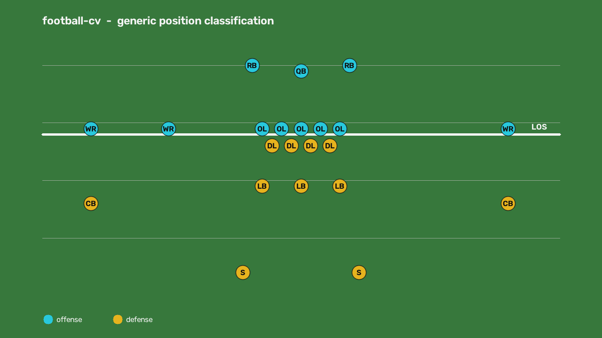

# football-cv

Generic computer-vision pipeline for tracking football players from film and
classifying them into standard positions. Point it at a play, and it detects
every player, tracks them across frames, calibrates the camera to field
coordinates, assigns teams by jersey color, and labels each tracked player with
a generic position token.

MIT licensed.

## What it does

```
film → person detection → multi-object tracking → field calibration
     → team assignment → generic position classification → positions.json
```

Each stage is an independent module under `ml/` that reads and writes per-play
artifacts on disk. The headline module is `ml/positions.py`: a pure,
geometry-driven classifier that maps a player's field-relative alignment to a
standard position. It uses only generic football geometry (line of scrimmage,
offense/defense split, alignment depth and width) — no proprietary playbook
logic.

## Demo



The classifier assigns a generic position to every player from geometry alone.
The image above is produced by the bundled demo — no film and no torch required
(it runs on `numpy` + `opencv` only):

```bash
pip install -e .
python -m ml.demo          # writes examples/demo.png, demo.mp4, demo.positions.json
```

A short clip of the same play is at [`examples/demo.mp4`](examples/demo.mp4).

## Install

```bash
pip install -e .              # classifier + demo (numpy, opencv-python, scipy)
pip install -e ".[detect]"    # + YOLO person detection (pulls in torch)
pip install -e ".[dev]"       # + test dependencies (pytest)
```

Requires Python 3.11+. Person detection (`ultralytics`/YOLO, and therefore
torch) is an optional extra — the position classifier, demo, and tests run
without it.

## Usage

### Bring your own film

Upload a clip, then run the pipeline on it:

```bash
# copy your film into place as a named play
python -m ml.cli ingest my_play --video path/to/film.mp4 --data ./data

# run the full pipeline end to end (needs the [detect] extra)
python -m ml.cli all my_play --data ./data
```

`ingest` copies your video to `data/plays/<play_id>/clip.mp4`, which every
downstream stage reads. You can also drop a `clip.mp4` there yourself.

### Run individual stages

```bash
python -m ml.cli detect my_play --data ./data
```

Stages, in pipeline order: `ingest`, `detect`, `track`, `autocal`, `field`,
`teamcolor`, `positions`. `all` runs `detect`→`positions` in sequence. Each
stage reads the artifacts written by the previous one from the play's directory
under `--data`. The final stage writes `positions.json`, a map from track id to
position token.

See [`examples/`](examples/) for a sample `positions.json`.

## Position taxonomy

The classifier emits eight generic tokens — four per side of the ball:

| Side    | Tokens                                   |
| ------- | ---------------------------------------- |
| Defense | `DL` `LB` `CB` `S`                       |
| Offense | `OL` `QB` `RB` `WR`                      |

| Token | Position          | Read                                         |
| ----- | ----------------- | -------------------------------------------- |
| `DL`  | Defensive line    | On the line, defensive side                  |
| `LB`  | Linebacker        | A few yards off the line, inside             |
| `CB`  | Cornerback        | Near the line depth but split wide           |
| `S`   | Safety            | Deep off the line, toward the middle         |
| `OL`  | Offensive line    | On the line, offensive side                  |
| `QB`  | Quarterback       | Deepest, laterally centered back             |
| `RB`  | Running back      | In the backfield, off center                 |
| `WR`  | Wide receiver     | Split wide from the offensive line           |

These are inferred purely from field-relative geometry.

## Viewer

`viewer/` holds a React Native / Expo + Skia field renderer that draws a field
and overlays player markers by position token, plus a film-replay overlay and a
`FilmUpload` control that opens the system document picker to choose a clip. It
ships with a neutral color palette and no team branding. The viewer is an
early-stage port; full Expo build wiring is out of scope for v0.1.

## License

MIT. See [`LICENSE`](LICENSE).
