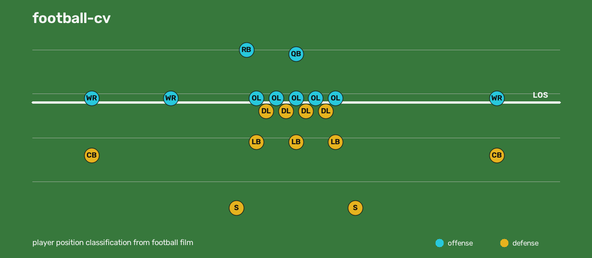

<div align="center">



# football-cv

**Detect, track, and classify every player on a football play — from film.**

[](https://github.com/andrewneuwirth/football-cv/actions/workflows/ci.yml)
[](LICENSE)
[](pyproject.toml)
[](#evaluation)

</div>

football-cv is a computer-vision pipeline that turns a single-play video into
**position labels for all 22 players**. It detects everyone on the field, tracks
them across frames, calibrates the camera to real field coordinates, splits the
two teams by jersey color, finds the line of scrimmage and the snap, throws out
the officials and sideline crews, and classifies each player by alignment —
`DL / LB / CB / S` on defense, `OL / QB / RB / WR` on offense.

It's a **toolkit**, not just an app: one-call Python API, a `football-cv` CLI,
and a browser calibration + overlay viewer.

```
film → detect → track → team colors → stitch fragments
     → calibrate → field project → line of scrimmage + snap → positions.json
```

## Why

Most "player tracking" stops at boxes. The hard part is turning those boxes into
*football* — which body is a defensive lineman vs. a safety, who's offense vs.
defense, where the ball is. That needs camera calibration to field yards, a
jersey-color team split, robust snap detection, and filtering out everyone who
isn't in the play (refs, benches, chain crew). football-cv does all of it and
emits plain, standard position groups — no team- or playbook-specific naming.

## Install

```bash
pip install -e .              # the classifier + pipeline (numpy, scipy, opencv)
pip install -e ".[detect]"    # + YOLO person detection (pulls in torch)
pip install -e ".[dev]"       # + pytest
```

Python 3.11+. Detection (torch) is an **optional extra** — everything downstream
of tracking runs torch-free.

## Quickstart

### As a library

```python
import footballcv

positions = footballcv.analyze(
    video="play.mp4",
    calibration={                                  # pixel -> field yards
        "frame": 120,
        "points": [
            {"px": 20,   "py": 1030, "fx": 30, "fy": 0.0},    # 30 yd @ near sideline
            {"px": 1900, "py": 300,  "fx": 30, "fy": 53.33},  # 30 yd @ far sideline
            {"px": 700,  "py": 1040, "fx": 45, "fy": 0.0},    # 45 yd @ near sideline
            {"px": 1905, "py": 470,  "fx": 45, "fy": 53.33},  # 45 yd @ far sideline
        ],
    },
    snap=120,   # optional: frame to anchor the pre-snap alignment
)
# -> {"3": "DL", "11": "LB", "24": "S", "41": "OL", "52": "QB", ...}
```

Lower-level helpers when you want to drive it yourself:

```python
from footballcv import calibrate, set_snap, load_positions, load_labels

calibrate("play1", "./data", points=[...], frame=120)   # write calibration.json
set_snap("play1", "./data", frame=120)                  # write snap.json
positions = load_positions("./data", "play1")           # {track_id: group}
labels = load_labels("./data", "play1")                 # teams, LOS, snap, ...
```

### As a CLI

```bash
football-cv ingest myplay --video play.mp4 --data ./data
football-cv all    myplay --data ./data          # detect -> ... -> positions
football-cv positions myplay --data ./data       # a single stage
```

Every stage reads and writes per-play artifacts under
`data/plays/<play_id>/`, so runs are inspectable, resumable, and reproducible.
See [`examples/`](examples/) for a sample `positions.json`.

## Position groups

Inferred from field-relative alignment. Defense uses full alignment logic;
offense is tagged generically.

| Defense | Read                         | Offense | Read                        |
| ------- | ---------------------------- | ------- | --------------------------- |
| `DL`    | on the line of scrimmage     | `OL`    | on the line                 |
| `LB`    | off the line, inside         | `WR`    | split wide                  |
| `CB`    | pressed wide, near boundary  | `QB`    | deep, centered              |
| `S`     | deep, toward the middle      | `RB`    | in the backfield            |

## How it works

Each stage is an independent module under `footballcv/`:

| Stage        | Module          | Does                                                      |
| ------------ | --------------- | -------------------------------------------------------- |
| `detect`     | `detect.py`     | person detection per frame (YOLO)                        |
| `track`      | `track.py`      | multi-object tracking into stable ids                    |
| `teamcolor`  | `teamcolor.py`  | jersey-color clustering → team A/B/ref                   |
| `stitch`     | `stitch.py`     | merge track fragments of one player into one track       |
| `autocal`    | `autocal.py`    | transfer a calibration from a same-game reference play   |
| `field`      | `field.py`      | project every track to field yards via homography        |
| `positions`  | `positions.py`  | LOS + snap, participant filtering, position classification |

Calibration is the one manual input: mark ≥4 field points (yard-line × sideline)
on one frame. `autocal` then transfers it to other plays in the same game by
feature matching.

## Evaluation

Measured against **21 hand-labeled plays (162 players)** with `footballcv.eval`
(the labels are private; the tool and numbers are not):

```
overall accuracy         ~70%     (69% heuristic offense → ~70% learned)
excluding the line (OL/DL)  ~65%   (the line is the easy class)
```

Defense per class (the deterministic alignment/role logic):

| group | precision | recall |  f1  |  n  |     | group | precision | recall |  f1  |  n  |
| ----- | :-------: | :----: | :--: | :-: | --- | ----- | :-------: | :----: | :--: | :-: |
| `CB`  |   1.00    |  0.89  | 0.94 | 18  |     | `LB`  |   0.83    |  0.69  | 0.75 | 35  |
| `DL`  |   0.87    |  0.87  | 0.87 | 23  |     | `S`   |   0.68    |  0.71  | 0.70 | 21  |

**Defense (~77%) is the strength** — the full alignment/role logic. **The
offense backfield was the weak spot**: `QB` and `RB` are near-identical in
field-relative alignment, so the geometric heuristic couldn't tell them apart.

### Learned offense model

Rather than tune more thresholds, the offense step uses a small
**RandomForest** on alignment features (depth, lateral spread, rank among
teammates). Trained and scored with **leave-one-play-out** cross-validation so
no play leaks between train and test:

| offense | OL | QB | RB | WR | overall |
| ------- | :-: | :-: | :-: | :-: | :-----: |
| geometric heuristic | 82% | **12%** | 47% | 63% | 57% |
| **learned (RF)**    | 82% | **50%** | 36% | 69% | **61%** |

The heuristic essentially couldn't find the quarterback (1/8); the model gets it
half the time — a genuinely learned win where rules failed. It ships in the
package and loads automatically; without the `[ml]` extra it falls back to the
heuristic, so the core install stays dependency-free.

An RF over *all* positions was also tried — it ties the tuned defense logic and
regresses QB, so learning is applied only where it helps (offense).

Reproduce / retrain with your own labeled plays:

```bash
python -m footballcv.eval          --data ./data --plays play1,play2   # score
python -m footballcv.train_offense --data ./data                       # retrain
```

## Viewer

A zero-build browser tool under `viewer/`:

- `viewer/web/calibrate.html` — scrub to a frame, click field points, mark the snap
- `viewer/web/result.html` — the classified positions drawn over the film
- `viewer/backend/serve.py` — local server that saves calibrations, runs the
  pipeline, and renders overlays

```bash
python viewer/backend/serve.py
# open http://localhost:8000/calibrate.html?play=<play_id>
```

## License

MIT — see [`LICENSE`](LICENSE).
